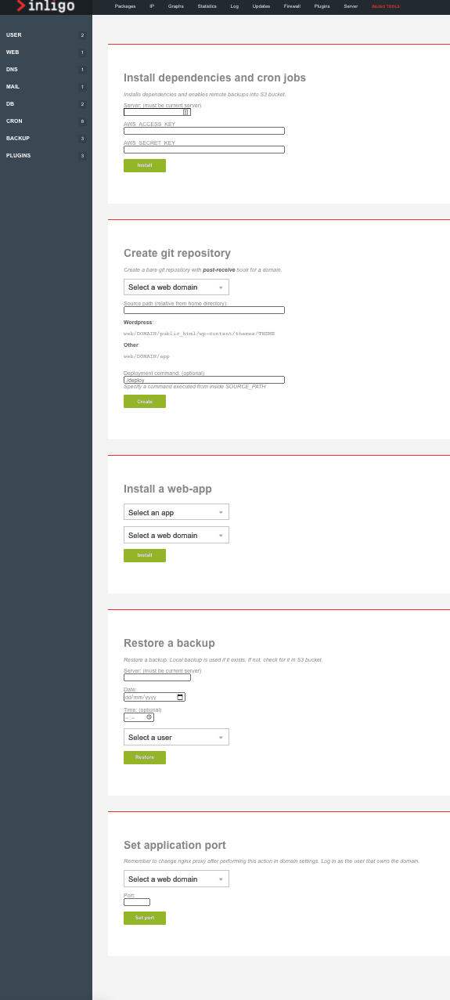

## Vesta App Installer

## Installation

* Install [Vesta Plugins](https://github.com/jhmaverick/vestacp-plugin-manager) if not already installed.
* In the Vesta panel access "Plugins" menu and add the plugin by url `https://github.com/inligo-as/vesta-inligo-apps`.

`sudo /usr/local/vesta/bin/v-backup-users && sleep 5 && /home/admin/downloads/server-scripts/upload_newest_backup.sh digitalocean_polyflor admin >/dev/null 2>&1`